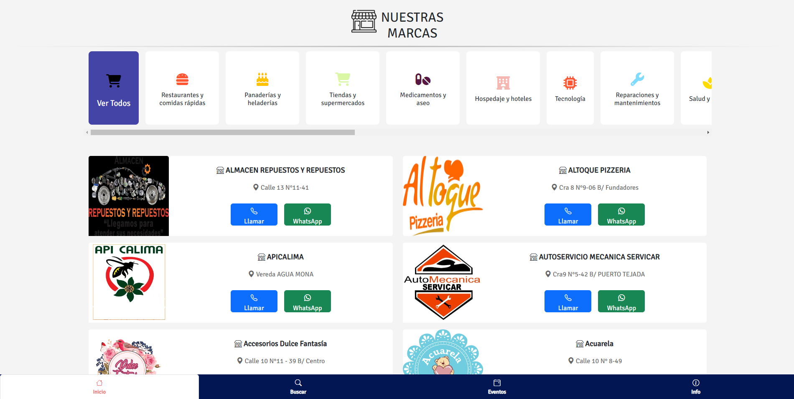

# Yo Compro en Restrepo

Bienvenido al repositorio de "Yo Compro en Restrepo", una plataforma digital que tiene como objetivo apoyar a los comerciantes y consumidores en la zona de Restrepo Valle, Colombia. Nuestra misión es facilitar la búsqueda y conexión entre los negocios locales y sus clientes potenciales, promoviendo el comercio local y fortaleciendo la comunidad.

## ¿Qué puedes encontrar en nuestra plataforma?

- **Negocios locales**: Descubre una amplia variedad de negocios en la zona de Restrepo, desde tiendas de ropa y calzado hasta restaurantes y servicios profesionales.
- **Información detallada**: Obtén información valiosa sobre cada negocio, como su descripción, dirección y formas de contacto.
- **Fácil comunicación**: Con solo un clic, puedes llamar o enviar mensajes a los negocios a través de WhatsApp.
- **Instalable en dispositivos móviles**: Nuestra aplicación web progresiva (PWA) se puede instalar en dispositivos Android e iOS, lo que facilita el acceso a la información en cualquier momento y lugar.

## ¿Cómo utilizar nuestra plataforma?

1. Visita nuestra plataforma en el navegador de tu dispositivo (computadora, tableta o teléfono móvil) a través del siguiente enlace: [Yo Compro en Restrepo](https://yocomproenrestrepo.com/).
2. Explora la lista de negocios y eventos en la zona de Restrepo.
3. Si deseas obtener más información sobre un negocio, haz clic en su tarjeta para acceder a su página de detalles.
4. Para contactar con un negocio, utiliza los botones de "Llamar" y "WhatsApp" en la página de detalles.

## ¿Tienes alguna sugerencia o pregunta?

Nos encantaría saber de ti. Si tienes alguna sugerencia, pregunta o comentario, no dudes en ponerte en contacto con nosotros a través de nuestro formulario de contacto o envíanos un correo electrónico a [info@yocomproenrestrepo.com](mailto:info@yocomproenrestrepo.com).

_____________________________________________________________________________________________________________________________________________________

# DESARROLLADORES

Bienvenido al repositorio de "Yo Compro en Restrepo", una plataforma digital que tiene como objetivo apoyar a los comerciantes y consumidores en la zona de Restrepo Valle, Colombia.

## Tecnologías utilizadas

- Angular
- TypeScript
- Bootstrap
- SCSS

## Configuración del entorno de desarrollo

1. Asegúrate de tener instalado [Node.js](https://nodejs.org/) y [npm](https://www.npmjs.com/) en tu computadora.
2. Clona este repositorio en tu máquina local ejecutando `git clone https://github.com/thiagoc789/ComerciantesR.git`.
3. Navega al directorio del proyecto: `cd ComerciantesR`.
4. Instala las dependencias del proyecto ejecutando `npm install`.
5. Inicia el servidor de desarrollo ejecutando `ng serve`.
6. Abre tu navegador y ve a `http://localhost:4200/` para ver la aplicación en ejecución.

## Contribuyendo al proyecto

Si deseas contribuir al proyecto, sigue estos pasos:

1. Haz un fork del repositorio.
2. Crea una nueva rama en tu fork con un nombre descriptivo, por ejemplo, `feature/add-new-feature` o `bugfix/fixing-bug`.
3. Realiza tus cambios en la rama creada.
4. Asegúrate de que tus cambios no rompen ninguna funcionalidad existente y de que se ajustan a las guías de estilo del proyecto.
5. Envía tus cambios en un Pull Request desde tu fork al repositorio original, especificando la rama de destino y proporcionando una descripción detallada de los cambios realizados.

## Contacto

Si tienes preguntas, sugerencias o problemas con el código, no dudes en abrir un Issue en GitHub o ponte en contacto con nosotros a través del correo electrónico [info@yocomproenrestrepo.com](mailto:info@yocomproenrestrepo.com).

